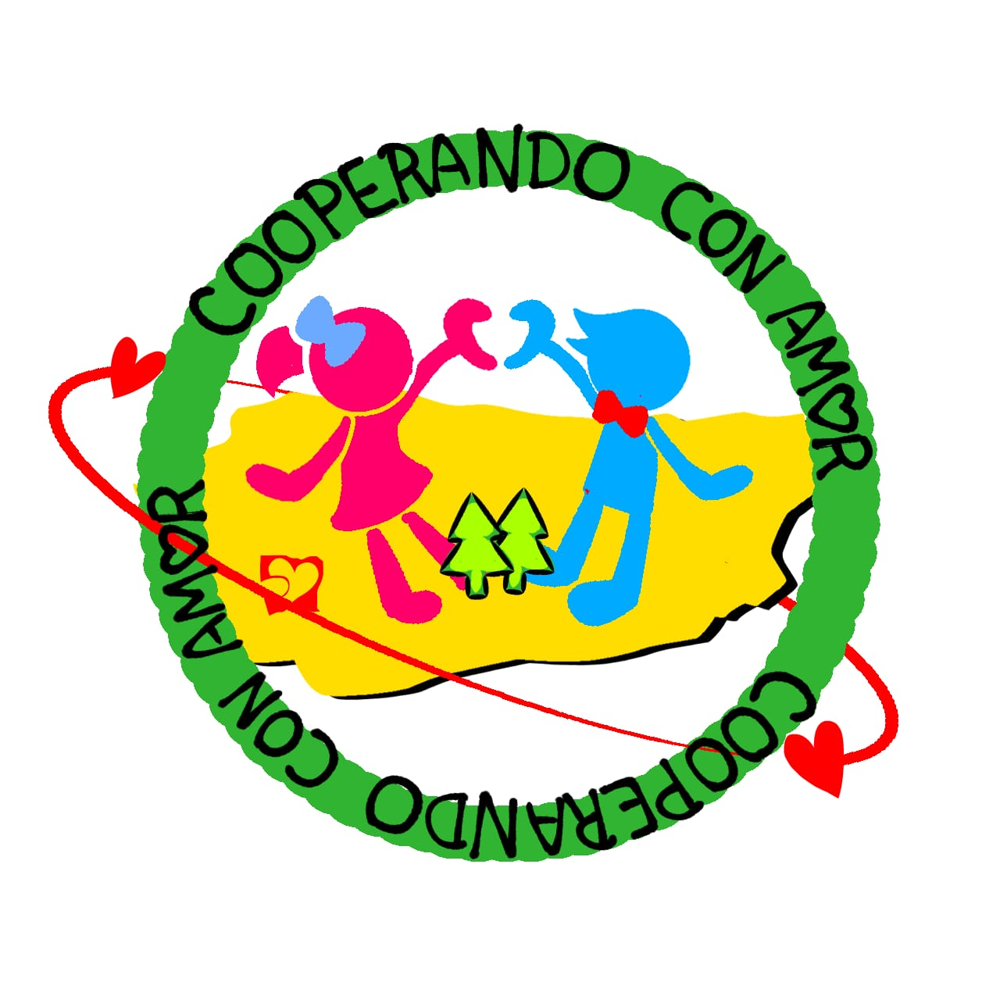

<!DOCTYPE html>
<html lang="es">
<head>
    <meta charset="UTF-8" />
    <meta name="viewport" content="width=device-width, initial-scale=1.0"/>
    <title>Cooperando Con Amor</title>
    
</head>
<body>
    <header>
        
        

            <h1>Cooperando Con Amor</h1>
            
"Unidos por el amor, transformamos el mundo"

        

    </header>
    <main>
        <section class="descripcion">
            
Somos una organización dedicada a promover la solidaridad y cooperación para mejorar el bienestar de nuestra comunidad, generando un impacto positivo, justo e inclusivo.

        </section>
        <section class="formulario">
            
<strong>¿Tienes alguna pregunta o mensaje? Déjanos saber mediante este formulario y te responderemos por correo electrónico:</strong>

            <form action="https://formspree.io/f/xeognznp" method="POST">
                <label for="nombre">Nombre</label>
                <input type="text" id="nombre" name="nombre" required>

                <label for="email">Correo electrónico</label>
                <input type="email" id="email" name="email" required>

                <label for="mensaje">Pregunta o mensaje</label>
                <textarea id="mensaje" name="mensaje" rows="5" required></textarea>

                <button type="submit">Enviar</button>
            </form>
        </section>
    </main>
</body>
</html>
